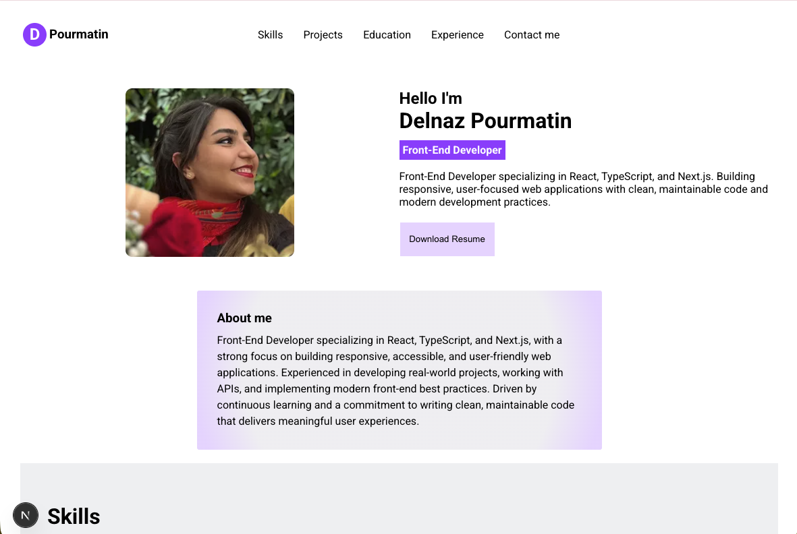

# Personal Portfolio

A modern and responsive portfolio website built with **Next.js**, **TypeScript**, and **CSS**, showcasing my skills, projects, experience, and contact information.

## About

This portfolio was created to present my work as a Front-End Developer and highlight my experience with modern web technologies. The website includes information about my background, technical skills, featured projects, education, and ways to get in touch.

## Features

- Responsive design for desktop, tablet, and mobile devices
- Modern and clean user interface
- Downloadable resume
- Project showcase section
- Skills and experience sections
- Smooth scrolling navigation
- Contact links for easy communication

## Built With

- Next.js
- React
- TypeScript
- CSS
- Git & GitHub

## Live Demo

[View Portfolio](YOUR_VERCEL_URL)

## Screenshot



## Getting Started

Clone the repository:

```bash
git clone https://github.com/Delnazmatin/personal-portfolio.git
```

Install dependencies:

```bash
npm install
```

Run the development server:

```bash
npm run dev
```

Build for production:

```bash
npm run build
```

## Contact

- GitHub: https://github.com/Delnazmatin
- LinkedIn: https://www.linkedin.com/in/delnaz-pourmatin-771018352/
- Email: DelnazMatin@gmail.com
